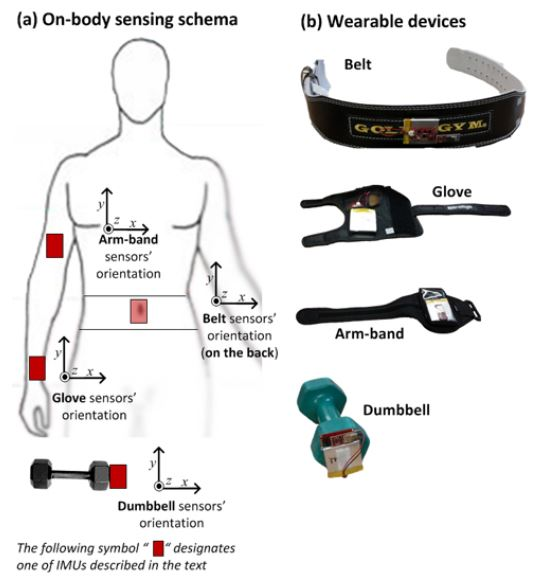

## Background  
Using devices such as *Jawbone Up, Nike FuelBand*, and *Fitbit* it is now possible to collect a large amount of data about personal activity relatively inexpensively. One thing that people regularly do is quantify how much of a particular activity they do, but they rarely quantify how well they do it. This project aims to use data from accelerometers on the belt, forearm, arm, and dumbell (see Figure 1) in order to predict the quality of the performed exercises.  
Six young health participants aged between 20-28 years, supervised by an experienced weight lifter, were asked to perform one set of 10 repetitions of the Unilateral Dumbbell Biceps Curl in five different fashions:  

* Class A - Exactly according to the specification.  
* Class B - Throwing the elbows to the front.  
* Class C - Lifting the dumbbell only halfway.  
* Class D - Lowering the dumbbell only halfway.  
* Class E - Throwing the hips to the front.  

Class A corresponds to the specified execution of the exercise, while the other 4 classes correspond to common mistakes.  

  

<br><br>  

The data-set consists of information acquired by a sliding window approach with different lengths from 0.5 second to 2.5 seconds, with 0.5 second overlap. In each step of the sliding window approach features were calculated on the Euler angles (roll, pitch and yaw), as well as raw accelerometer, gyroscope and magnetometer readings. Also, for the Euler angles of each of the four sensors eight features were calculated: mean, variance, standard deviation, max, min, amplitude, kurtosis and skewness, generating in total 96 derived feature sets. 


## Data Understanding and Cleaning  
The dataset was divided into a large [Training-Set](https://d396qusza40orc.cloudfront.net/predmachlearn/pml-training.csv) and a small [Test-Set](https://d396qusza40orc.cloudfront.net/predmachlearn/pml-testing.csv) (20 observations). The performance quality (how well the exercise was performed) is represented by the "class" variable in the Training set (Target-Feature).    

```r
#Loading data
train<-read.csv("pml-training.csv", check.names=TRUE, na.strings=c("","NA"))
test<-read.csv("pml-testing.csv", check.names=TRUE, na.strings=c("","NA"))
```
Both sets consist of 159 variables (not including the target feature)
First task (shown below) is to narrow down the amount of features in order to find relevant predictors. This was done by several steps:  
1. Excluding variables which cannot supply any insight (near zero variance).  
2. Excluding variables which contain mostly NA values.  
3. Removing highly correlated variables which may mask interactions in generated models and increse variability.  


```r
#-----------Data Understanding and Cleaning------------------
## Narrowing amount of features to find relevant predictors
## Excluding variables which cannot supply any insight (near zero variance)
nearZValue<-nearZeroVar(train,saveMetrics = T)
trainClean <- train[, !nearZValue$nzv]
##Excluding variables which contain NAs
noNAs <- (colSums(is.na(trainClean)) == 0)
trainClean <- trainClean[, noNAs]
## Remove non-numeric variables (user info which is not needed for the analysis) for correlation matrix
trainCleanNum<-select_if(trainClean, is.numeric)
trainCleanNum<-trainCleanNum[,-c(1:4)]
## Calculate correlation matrix
corrMatrix <- cor(trainCleanNum)
## Find features that are highly correlated (ideally >0.75)
highlyCorr <- findCorrelation(corrMatrix, cutoff=0.75, names=T)
## Adjust training set (removing the highly correlated variables found above)
trainSet<-trainCleanNum[, -which(names(trainCleanNum) %in% highlyCorr)]
trainSet<-trainSet[,-1]
## Adding "class" target-variable back to the data-set
testSet<-test[,colnames(trainSet)]
trainClass<-trainSet
trainClass[,"class"]<-trainClean[,ncol(trainClean)]
```

## Descriptive Statistics and Correlations  
The information below shows that the modified dataset is now consisting of only 31 variables (including the target feature). The basic statistics of each variable can reveal its range among other parameters such as average and median values. Since we are intrested in the "class" feature, a simple barplot (Figure 2) was made in order to get first impression regarding the distribution of this key-feature. According to the graph class A is the most abundant method executed in this dataset.  

```r
##Statistics and plot of target feature
str(trainClass)
```

```
## 'data.frame':	19622 obs. of  31 variables:
##  $ gyros_belt_x        : num  0 0.02 0 0.02 0.02 0.02 0.02 0.02 0.02 0.03 ...
##  $ gyros_belt_y        : num  0 0 0 0 0.02 0 0 0 0 0 ...
##  $ gyros_belt_z        : num  -0.02 -0.02 -0.02 -0.03 -0.02 -0.02 -0.02 -0.02 -0.02 0 ...
##  $ magnet_belt_x       : int  -3 -7 -2 -6 -6 0 -4 -2 1 -3 ...
##  $ magnet_belt_y       : int  599 608 600 604 600 603 599 603 602 609 ...
##  $ roll_arm            : num  -128 -128 -128 -128 -128 -128 -128 -128 -128 -128 ...
##  $ pitch_arm           : num  22.5 22.5 22.5 22.1 22.1 22 21.9 21.8 21.7 21.6 ...
##  $ yaw_arm             : num  -161 -161 -161 -161 -161 -161 -161 -161 -161 -161 ...
##  $ total_accel_arm     : int  34 34 34 34 34 34 34 34 34 34 ...
##  $ gyros_arm_y         : num  0 -0.02 -0.02 -0.03 -0.03 -0.03 -0.03 -0.02 -0.03 -0.03 ...
##  $ gyros_arm_z         : num  -0.02 -0.02 -0.02 0.02 0 0 0 0 -0.02 -0.02 ...
##  $ magnet_arm_x        : int  -368 -369 -368 -372 -374 -369 -373 -372 -369 -376 ...
##  $ magnet_arm_z        : int  516 513 513 512 506 513 509 510 518 516 ...
##  $ roll_dumbbell       : num  13.1 13.1 12.9 13.4 13.4 ...
##  $ pitch_dumbbell      : num  -70.5 -70.6 -70.3 -70.4 -70.4 ...
##  $ yaw_dumbbell        : num  -84.9 -84.7 -85.1 -84.9 -84.9 ...
##  $ total_accel_dumbbell: int  37 37 37 37 37 37 37 37 37 37 ...
##  $ gyros_dumbbell_y    : num  -0.02 -0.02 -0.02 -0.02 -0.02 -0.02 -0.02 -0.02 -0.02 -0.02 ...
##  $ magnet_dumbbell_z   : num  -65 -64 -63 -60 -68 -66 -70 -74 -65 -69 ...
##  $ roll_forearm        : num  28.4 28.3 28.3 28.1 28 27.9 27.9 27.8 27.7 27.7 ...
##  $ pitch_forearm       : num  -63.9 -63.9 -63.9 -63.9 -63.9 -63.9 -63.9 -63.8 -63.8 -63.8 ...
##  $ yaw_forearm         : num  -153 -153 -152 -152 -152 -152 -152 -152 -152 -152 ...
##  $ total_accel_forearm : int  36 36 36 36 36 36 36 36 36 36 ...
##  $ gyros_forearm_x     : num  0.03 0.02 0.03 0.02 0.02 0.02 0.02 0.02 0.03 0.02 ...
##  $ gyros_forearm_z     : num  -0.02 -0.02 0 0 -0.02 -0.03 -0.02 0 -0.02 -0.02 ...
##  $ accel_forearm_x     : int  192 192 196 189 189 193 195 193 193 190 ...
##  $ accel_forearm_z     : int  -215 -216 -213 -214 -214 -215 -215 -213 -214 -215 ...
##  $ magnet_forearm_x    : int  -17 -18 -18 -16 -17 -9 -18 -9 -16 -22 ...
##  $ magnet_forearm_y    : num  654 661 658 658 655 660 659 660 653 656 ...
##  $ magnet_forearm_z    : num  476 473 469 469 473 478 470 474 476 473 ...
##  $ class               : chr  "A" "A" "A" "A" ...
```

```r
summary(trainClass)
```

```
##   gyros_belt_x        gyros_belt_y       gyros_belt_z     magnet_belt_x  
##  Min.   :-1.040000   Min.   :-0.64000   Min.   :-1.4600   Min.   :-52.0  
##  1st Qu.:-0.030000   1st Qu.: 0.00000   1st Qu.:-0.2000   1st Qu.:  9.0  
##  Median : 0.030000   Median : 0.02000   Median :-0.1000   Median : 35.0  
##  Mean   :-0.005592   Mean   : 0.03959   Mean   :-0.1305   Mean   : 55.6  
##  3rd Qu.: 0.110000   3rd Qu.: 0.11000   3rd Qu.:-0.0200   3rd Qu.: 59.0  
##  Max.   : 2.220000   Max.   : 0.64000   Max.   : 1.6200   Max.   :485.0  
##  magnet_belt_y      roll_arm         pitch_arm          yaw_arm         
##  Min.   :354.0   Min.   :-180.00   Min.   :-88.800   Min.   :-180.0000  
##  1st Qu.:581.0   1st Qu.: -31.77   1st Qu.:-25.900   1st Qu.: -43.1000  
##  Median :601.0   Median :   0.00   Median :  0.000   Median :   0.0000  
##  Mean   :593.7   Mean   :  17.83   Mean   : -4.612   Mean   :  -0.6188  
##  3rd Qu.:610.0   3rd Qu.:  77.30   3rd Qu.: 11.200   3rd Qu.:  45.8750  
##  Max.   :673.0   Max.   : 180.00   Max.   : 88.500   Max.   : 180.0000  
##  total_accel_arm  gyros_arm_y       gyros_arm_z       magnet_arm_x   
##  Min.   : 1.00   Min.   :-3.4400   Min.   :-2.3300   Min.   :-584.0  
##  1st Qu.:17.00   1st Qu.:-0.8000   1st Qu.:-0.0700   1st Qu.:-300.0  
##  Median :27.00   Median :-0.2400   Median : 0.2300   Median : 289.0  
##  Mean   :25.51   Mean   :-0.2571   Mean   : 0.2695   Mean   : 191.7  
##  3rd Qu.:33.00   3rd Qu.: 0.1400   3rd Qu.: 0.7200   3rd Qu.: 637.0  
##  Max.   :66.00   Max.   : 2.8400   Max.   : 3.0200   Max.   : 782.0  
##   magnet_arm_z    roll_dumbbell     pitch_dumbbell     yaw_dumbbell     
##  Min.   :-597.0   Min.   :-153.71   Min.   :-149.59   Min.   :-150.871  
##  1st Qu.: 131.2   1st Qu.: -18.49   1st Qu.: -40.89   1st Qu.: -77.644  
##  Median : 444.0   Median :  48.17   Median : -20.96   Median :  -3.324  
##  Mean   : 306.5   Mean   :  23.84   Mean   : -10.78   Mean   :   1.674  
##  3rd Qu.: 545.0   3rd Qu.:  67.61   3rd Qu.:  17.50   3rd Qu.:  79.643  
##  Max.   : 694.0   Max.   : 153.55   Max.   : 149.40   Max.   : 154.952  
##  total_accel_dumbbell gyros_dumbbell_y   magnet_dumbbell_z
##  Min.   : 0.00        Min.   :-2.10000   Min.   :-262.00  
##  1st Qu.: 4.00        1st Qu.:-0.14000   1st Qu.: -45.00  
##  Median :10.00        Median : 0.03000   Median :  13.00  
##  Mean   :13.72        Mean   : 0.04606   Mean   :  46.05  
##  3rd Qu.:19.00        3rd Qu.: 0.21000   3rd Qu.:  95.00  
##  Max.   :58.00        Max.   :52.00000   Max.   : 452.00  
##   roll_forearm       pitch_forearm     yaw_forearm     
##  Min.   :-180.0000   Min.   :-72.50   Min.   :-180.00  
##  1st Qu.:  -0.7375   1st Qu.:  0.00   1st Qu.: -68.60  
##  Median :  21.7000   Median :  9.24   Median :   0.00  
##  Mean   :  33.8265   Mean   : 10.71   Mean   :  19.21  
##  3rd Qu.: 140.0000   3rd Qu.: 28.40   3rd Qu.: 110.00  
##  Max.   : 180.0000   Max.   : 89.80   Max.   : 180.00  
##  total_accel_forearm gyros_forearm_x   gyros_forearm_z   
##  Min.   :  0.00      Min.   :-22.000   Min.   : -8.0900  
##  1st Qu.: 29.00      1st Qu.: -0.220   1st Qu.: -0.1800  
##  Median : 36.00      Median :  0.050   Median :  0.0800  
##  Mean   : 34.72      Mean   :  0.158   Mean   :  0.1512  
##  3rd Qu.: 41.00      3rd Qu.:  0.560   3rd Qu.:  0.4900  
##  Max.   :108.00      Max.   :  3.970   Max.   :231.0000  
##  accel_forearm_x   accel_forearm_z   magnet_forearm_x  magnet_forearm_y
##  Min.   :-498.00   Min.   :-446.00   Min.   :-1280.0   Min.   :-896.0  
##  1st Qu.:-178.00   1st Qu.:-182.00   1st Qu.: -616.0   1st Qu.:   2.0  
##  Median : -57.00   Median : -39.00   Median : -378.0   Median : 591.0  
##  Mean   : -61.65   Mean   : -55.29   Mean   : -312.6   Mean   : 380.1  
##  3rd Qu.:  76.00   3rd Qu.:  26.00   3rd Qu.:  -73.0   3rd Qu.: 737.0  
##  Max.   : 477.00   Max.   : 291.00   Max.   :  672.0   Max.   :1480.0  
##  magnet_forearm_z    class          
##  Min.   :-973.0   Length:19622      
##  1st Qu.: 191.0   Class :character  
##  Median : 511.0   Mode  :character  
##  Mean   : 393.6                     
##  3rd Qu.: 653.0                     
##  Max.   :1090.0
```

```r
t.class<-table(trainClass$class)
barplot(t.class,ylab = "count",xlab="", main = "Class Distribution", 
        sub = text(0.5,-900,expression(paste(bold("Figure 2:")," Class Distribution Barplot"))))

##Correlation test applied
corm<-rcorr(as.matrix(trainSet, use = "complete.obs"))
#Function ordering correlations and p-values together
flattenCorrMatrix <- function(cormat, pmat) {
  ut <- upper.tri(cormat)
  data.frame(
    row = rownames(cormat)[row(cormat)[ut]],
    column = rownames(cormat)[col(cormat)[ut]],
    cor  =(cormat)[ut],
    p = pmat[ut]
  )
}
#Applying the function above
par(xpd=TRUE)
corrplot(corm$r, type="upper", order="hclust", 
         p.mat = corm$P, sig.level = 0.01, insig = "blank", tl.col = "black", 
         tl.srt = 90, mar=c(0.5,0,8,0), tl.cex = 0.8)
```


**Figure 3:** Correlation Plot (Numeric Features)    
<br><br>

The correlation plot above (Figure 3) shows a glimpse view of the different correlations between the 30 numeric variables. This  proves that there is no high correlation between specific variables.  
Next section will try to find a suitable model which will be able to predict the target feature accurately.  

## Modeling  
In order to provide an unbiased evaluation of a model fit it is recommended to divide the training set into two parts: training set and validation set. 30% of the training set will be designated as validation set.  

```r
##Divide Training set into training and validation (70%-30%)
rowDesignatoin<-sample(nrow(trainClass), 0.7*nrow(trainClass), replace = FALSE)
trainingSet <- trainClass[rowDesignatoin,]
ValidSet <- trainClass[-rowDesignatoin,]
```

### Decision Tree  
Decision tree is well known for its compliance to classification tasks. The figure and table below show the outcome of the constructed decision tree. The table represents a prediction that was made on the training set itself, indicating that this model is not appropriate to predict the required target feature.  


```r
##Decision Tree
fit <- rpart(class~.,data=trainingSet, cp=0.03, method = 'class')
##fancyRpartPlot(fit, cex=1, tweak=0.7, sub = "testgfgfgf")
prp(fit)
title("Decision Tree Model",line = 1.5)
mtext(expression(paste(bold("Figure 4:")," Decision Tree Model")), line = -25, cex = 1.25)
### Predicting fit on trainingSet
predTrain <- predict(fit, trainingSet, type = "class")
### Checking classification accuracy
DTable<-table(predTrain, trainingSet$class)
kable(DTable, caption = "Classification accuracy (prediction on training set)", format = "html")%>%
  kable_styling(full_width = F)
```

<table class="table" style="width: auto !important; margin-left: auto; margin-right: auto;">
<caption>Classification accuracy (prediction on training set)</caption>
 <thead>
  <tr>
   <th style="text-align:left;">   </th>
   <th style="text-align:right;"> A </th>
   <th style="text-align:right;"> B </th>
   <th style="text-align:right;"> C </th>
   <th style="text-align:right;"> D </th>
   <th style="text-align:right;"> E </th>
  </tr>
 </thead>
<tbody>
  <tr>
   <td style="text-align:left;"> A </td>
   <td style="text-align:right;"> 3287 </td>
   <td style="text-align:right;"> 979 </td>
   <td style="text-align:right;"> 1045 </td>
   <td style="text-align:right;"> 614 </td>
   <td style="text-align:right;"> 534 </td>
  </tr>
  <tr>
   <td style="text-align:left;"> B </td>
   <td style="text-align:right;"> 136 </td>
   <td style="text-align:right;"> 979 </td>
   <td style="text-align:right;"> 110 </td>
   <td style="text-align:right;"> 327 </td>
   <td style="text-align:right;"> 539 </td>
  </tr>
  <tr>
   <td style="text-align:left;"> C </td>
   <td style="text-align:right;"> 252 </td>
   <td style="text-align:right;"> 572 </td>
   <td style="text-align:right;"> 1138 </td>
   <td style="text-align:right;"> 530 </td>
   <td style="text-align:right;"> 505 </td>
  </tr>
  <tr>
   <td style="text-align:left;"> D </td>
   <td style="text-align:right;"> 232 </td>
   <td style="text-align:right;"> 113 </td>
   <td style="text-align:right;"> 104 </td>
   <td style="text-align:right;"> 633 </td>
   <td style="text-align:right;"> 104 </td>
  </tr>
  <tr>
   <td style="text-align:left;"> E </td>
   <td style="text-align:right;"> 2 </td>
   <td style="text-align:right;"> 2 </td>
   <td style="text-align:right;"> 2 </td>
   <td style="text-align:right;"> 179 </td>
   <td style="text-align:right;"> 817 </td>
  </tr>
</tbody>
</table>


**Figure 4:** Simple Decision Tree

### Random Forest  
Following Velloso et al.(2013), Random Forest approach may overcome the characteristic noise in the sensor data and hence, may be more accurate. Below is the model data which show 1.22% of error estimate. The generated confusion matrix show clear advantage of the random forest compare to the decision tree previously created. 


```r
##Random Forest
randForst1 <- randomForest(as.factor(class) ~ ., data = trainingSet, importance = TRUE)
randForst1
```

```
## 
## Call:
##  randomForest(formula = as.factor(class) ~ ., data = trainingSet,      importance = TRUE) 
##                Type of random forest: classification
##                      Number of trees: 500
## No. of variables tried at each split: 5
## 
##         OOB estimate of  error rate: 1.23%
## Confusion matrix:
##      A    B    C    D    E class.error
## A 3904    4    1    0    0 0.001279100
## B   38 2595   11    0    1 0.018903592
## C    1   25 2358   14    1 0.017090454
## D    0    0   57 2221    5 0.027157249
## E    0    2    2    7 2488 0.004401761
```

The proportion of true cases accordding to the confusion matrices are 0.499 for the decision tree and 0.988 for the random forest. In order to further diagnose the efficiency of this generated random forest, and to finally approve its use on the testing set, Confusion Matrix and Statistics were applied on the validation set as follows:  


```r
### Predicting on validation set
predTrain <- predict(randForst1, ValidSet, type = "class")
### Checking classification accuracy
RMF<-table(predTrain, ValidSet$class)
kable(RMF, caption = "Classification accuracy (prediction on validation set)", format = "html")%>%
  kable_styling(full_width = F)
```

<table class="table" style="width: auto !important; margin-left: auto; margin-right: auto;">
<caption>Classification accuracy (prediction on validation set)</caption>
 <thead>
  <tr>
   <th style="text-align:left;">   </th>
   <th style="text-align:right;"> A </th>
   <th style="text-align:right;"> B </th>
   <th style="text-align:right;"> C </th>
   <th style="text-align:right;"> D </th>
   <th style="text-align:right;"> E </th>
  </tr>
 </thead>
<tbody>
  <tr>
   <td style="text-align:left;"> A </td>
   <td style="text-align:right;"> 1668 </td>
   <td style="text-align:right;"> 14 </td>
   <td style="text-align:right;"> 0 </td>
   <td style="text-align:right;"> 0 </td>
   <td style="text-align:right;"> 0 </td>
  </tr>
  <tr>
   <td style="text-align:left;"> B </td>
   <td style="text-align:right;"> 2 </td>
   <td style="text-align:right;"> 1133 </td>
   <td style="text-align:right;"> 21 </td>
   <td style="text-align:right;"> 0 </td>
   <td style="text-align:right;"> 0 </td>
  </tr>
  <tr>
   <td style="text-align:left;"> C </td>
   <td style="text-align:right;"> 0 </td>
   <td style="text-align:right;"> 4 </td>
   <td style="text-align:right;"> 996 </td>
   <td style="text-align:right;"> 29 </td>
   <td style="text-align:right;"> 4 </td>
  </tr>
  <tr>
   <td style="text-align:left;"> D </td>
   <td style="text-align:right;"> 0 </td>
   <td style="text-align:right;"> 0 </td>
   <td style="text-align:right;"> 6 </td>
   <td style="text-align:right;"> 903 </td>
   <td style="text-align:right;"> 2 </td>
  </tr>
  <tr>
   <td style="text-align:left;"> E </td>
   <td style="text-align:right;"> 1 </td>
   <td style="text-align:right;"> 1 </td>
   <td style="text-align:right;"> 0 </td>
   <td style="text-align:right;"> 1 </td>
   <td style="text-align:right;"> 1102 </td>
  </tr>
</tbody>
</table>

```r
confusionMatrix(as.factor(ValidSet$class), predTrain)
```

```
## Confusion Matrix and Statistics
## 
##           Reference
## Prediction    A    B    C    D    E
##          A 1668    2    0    0    1
##          B   14 1133    4    0    1
##          C    0   21  996    6    0
##          D    0    0   29  903    1
##          E    0    0    4    2 1102
## 
## Overall Statistics
##                                           
##                Accuracy : 0.9856          
##                  95% CI : (0.9822, 0.9885)
##     No Information Rate : 0.2857          
##     P-Value [Acc > NIR] : < 2.2e-16       
##                                           
##                   Kappa : 0.9817          
##  Mcnemar's Test P-Value : NA              
## 
## Statistics by Class:
## 
##                      Class: A Class: B Class: C Class: D Class: E
## Sensitivity            0.9917   0.9801   0.9642   0.9912   0.9973
## Specificity            0.9993   0.9960   0.9944   0.9940   0.9987
## Pos Pred Value         0.9982   0.9835   0.9736   0.9678   0.9946
## Neg Pred Value         0.9967   0.9951   0.9924   0.9984   0.9994
## Prevalence             0.2857   0.1964   0.1755   0.1547   0.1877
## Detection Rate         0.2833   0.1925   0.1692   0.1534   0.1872
## Detection Prevalence   0.2838   0.1957   0.1738   0.1585   0.1882
## Balanced Accuracy      0.9955   0.9880   0.9793   0.9926   0.9980
```

The output data show impressive results expressed in the overall statistics values. This indicates that the random forest classification model is likely to predict the target feature (Class) with good reliability.

## Prediction of the test set  
The final step is to predict the class variable for the test set (20 observations). The prediction output can be seen below. 15 of the 20 observations were classified as class A or B.


```r
### Predicting on test set
predTest <- predict(randForst1, testSet, type = "class")
predTest
```

```
##  1  2  3  4  5  6  7  8  9 10 11 12 13 14 15 16 17 18 19 20 
##  B  A  B  A  A  E  D  B  A  A  B  C  B  A  E  E  A  B  B  B 
## Levels: A B C D E
```

```r
count(data.frame(predTest),predTest)
```

```
## # A tibble: 5 × 2
##   predTest     n
##     <fctr> <int>
## 1        A     7
## 2        B     8
## 3        C     1
## 4        D     1
## 5        E     3
```

## Reference  

Velloso, E.; Bulling, A.; Gellersen, H.; Ugulino, W.; Fuks, H. Qualitative Activity Recognition of Weight Lifting Exercises. Proceedings of 4th International Conference in Cooperation with SIGCHI (Augmented Human '13) . Stuttgart, Germany: ACM SIGCHI, 2013.
